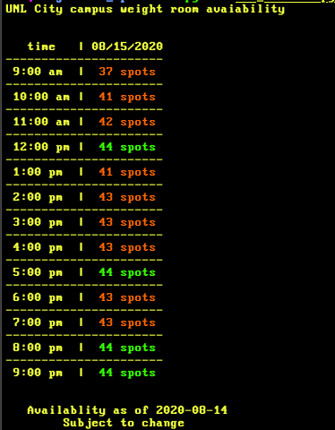

# Rec Checker
For fall of 2020, the UNL rec centers are operating on a reservation system wherein users [have to make a reservation to use a facility](https://newsroom.unl.edu/announce/nextatnebraska/11354/67079). The website for checking can be a bit clunky, so this commandline tool was created to see how many spots are left at each hour for the **city weightroom.** 
## Dependencies and Install
Rec Checker has only been tested on python3. It depends on the following external modules:
    
   + `urllib.request`
   + `BeautifulSoup`
    
Beyond that, it is recommened to make the script excecutable and callable from the commandline by adding the following line to the top of the script:

`#!path/to/python3`

and then the command:

`chmod +x rec_checker.py && export PATH=$(pwd):$PATH`

from this directory. This should allow use of the script from anywhere within the OS. If it does not, you may consider adding the following to your `.bash_profile` or similar config file:
`export PATH = "/path/to/re_checker/:$PATH"`

and then source the config file.

## Example Output
Below is an example output. The script will display how many spots are available for each of the times.

